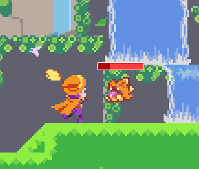
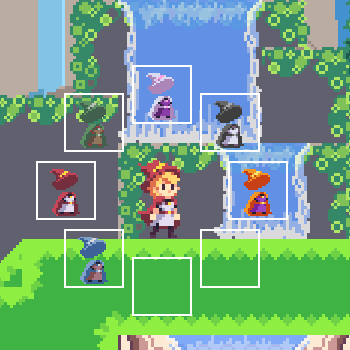
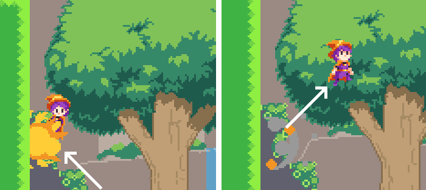
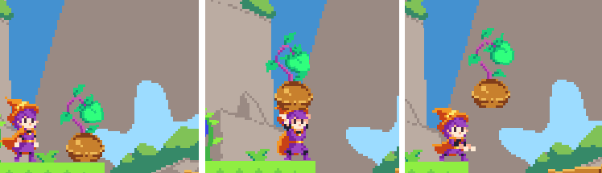
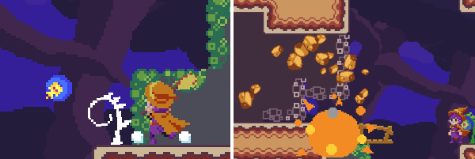

Collect the star at the top of the gardens. You'll need to rejuvenate two different berry types by restoring the water flow to each of their trees hidden in the gardens.

## Controls:

#Keyboard:
Z - Jump\
X - Broom\
C - Attack\
S + Direction - Change Color Set

#WASDMouse:
Space - Jump\
Shift - Broom\
Left Click - Attack
Tab/E + Direction - Change Color Set

#PS4:
X - Jump\
R1/Triangle/Circle - Broom\
Square - Attack
L1 + Direction - Change Color Set

#General Controls:

Left/Right - Move\
Down - Crouch\
Up - Enter Door, Lift Berry/Seed, Throw held object

##Attacking

\

## Attack Mechanics:
- Standing attack string (Attack -> Attack -> Attack)
- uptilt/crouch attack (Attack + Up / Attack + Crouch)
- arial attacks (Attack / Attack + Direction in air)
- crawl (Crouch + Left/Right)

With WASDMouse direction is determined by mouse position relative to Atlas.

##Colorsets:

You can change outfit colors by holding the change-outfit key, selecting with a direction, and letting go of the change key,
\

## Speed Run:
- **Press Space to reset.**
- Timer ends when all gems and the star are collected.
- Current Record is 42.7 seconds

##General Mechanics

**Drop through platforms**: Press Jump while crouching\
**Fast-fall**: Down while airborne\

**Cancel Broom**: Jump, Broom, or Attack while on broom\
**Jump off broom**: Jump while on broom (with double jump unlocked)

**Double-Jump**: (Jump -> Jump)\
**Wall-Jump**: (Press against wall in mid-air + Jump)
\

### Throwing Objects
\
Press Up while contacting a berry or a seed.\
Press Up or Jump to throw the object.\

## Berries:
Berries "pop" when hit by an attack or when bumped into while riding your broom.

- **Bounce Berries** force Atlas to jump even if she's in mid air- does not count as double jumping
- **Woosh Berries** force Atlas on her broom even if she's already used it. This does count as using your broom.
- **Bomb Berries** can blow up rocks and are affected by other berries:
   - Bombs bounce off bounce berries.
   - Bombs are given wings and will fly forward on collision with woosh berries.
   - Bomb berries can be picked by the player when collided against while on broom. Berries can be dropped by canceling the broom.
\
  
